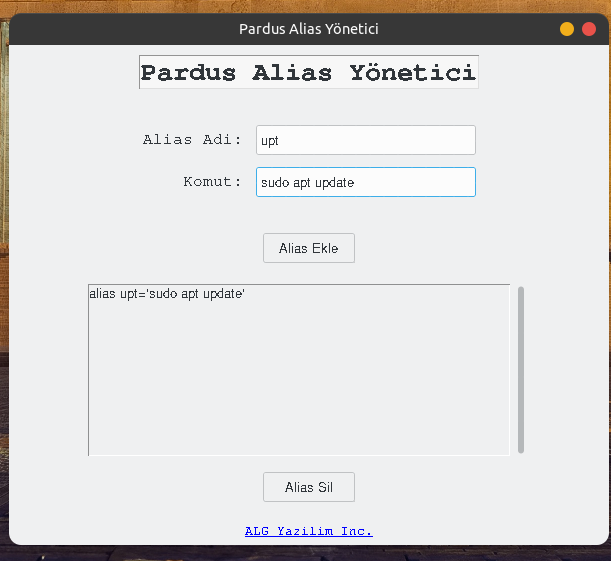

# aliasGUI-added
A Handy Python GUI Application for Customizing Terminal Scripts for Linux. Easy to Use with Visual Interface

Install Git Clone and Python3

Github Package Must Be Installed On Your Device.
```bash
sudo apt install git -y
```
Python
```bash
sudo apt install python3 -y
```
----------Required Libraries----------

Tkinter
```bash
sudo apt-get install python3-tk
```

ttkthemes
```bash
pip install ttkthemes
```

----------------------------------
https://fatihonder.org.tr/internet-speedtest-app-yapimi/

# Installation
Install aliasGUI-added


```bash
sudo git clone https://github.com/cektor/aliasGUI-added.git
```
```bash
cd aliasGUI-added/
```

```bash
python aliasGUI.py
```
or

```bash
python3 aliasGUI.py

```

# To compile

NOTE: For Compilation Process pyinstaller must be installed. To Install If Not Installed.

pip install pyinstaller 

Linux Terminal 
```bash
pyinstaller --onefile --windowed aliasGUI.py
```

# To run on Linux
Download and Run from the link

https://github.com/cektor/aliasGUI-added/releases/tag/1.0


# Linux Screenshot

 
